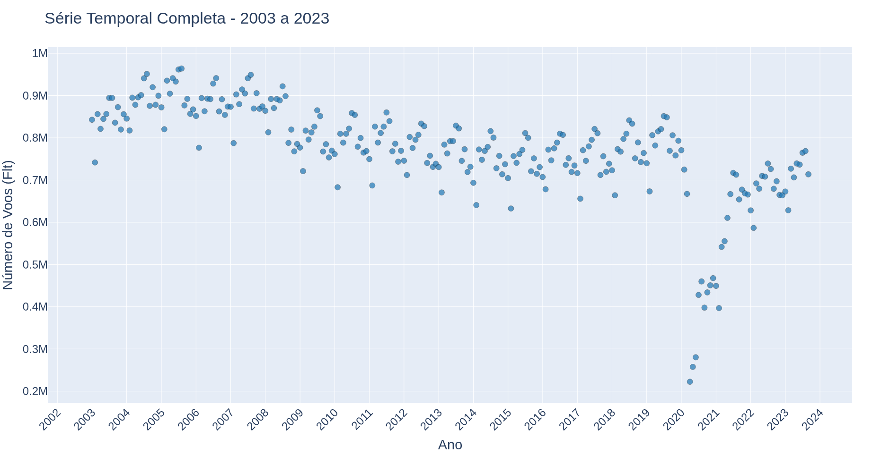

# IA048 - Atividade 1 - Regressão Linear

**Alunos:** Rafael Hoyos (175100), Pedro?

---

**Notas**

1. Para a confecção dos gráficos optamos pelo uso da biblioteca plotly do python e, para facilitar a estilização dos mesmos, foi feito uso do *Gemini Notebook* (antigo *NotebookLM*) [[1]](#referências) com acesso à documentação da biblioteca.

2. Os trechos de scripts em python presentes neste relatório contam com importações no formato:
    ```python
    import pandas as pd
    import plotly.express as px

    # sendo df:
    DATASET_PATH = "[caminho para o .csv do dataset]"
    df = pd.read_csv(DATASET_PATH, thousands=',')
    ```

---

## a.

Para gerar o gráfico, foi feito o script de um *scatter* simples com o número total de vôos (Flt) no eixo y e o tempo no eixo x:
```python
fig = px.scatter(
    df,
    x='Date',
    y='Flt',
    title='Série Temporal Completa - 2003 a 2023',
    labels={'Date': 'Ano', 'Flt': 'Número de Voos (Flt)'}
)

# Estilização do gráfico:
fig.update_traces(
    marker=dict(
        size=12,
        color='#1f77b4',
        opacity=0.7,
        line=dict(width=0.5, color='black')
    )
)
fig.update_xaxes(
    dtick="M24",            # Define o intervalo para cada 12 meses
    tickformat="%Y",        # Garante que o rótulo exiba apenas o Ano
    #tickangle=-45,         # Rotaciona os anos em -45° para que não fiquem sobrepostos
    hoverformat="%b %Y",    # Mostra o Mês e o Ano ao passar o mouse
    tick0="2003-01-01"      # Define o ano inicial exato para alinhar as marcações
)
fig.update_layout(
    font=dict(
        size=24
    )
)

fig.show()
```
A figura gerada foi:


As labels no eixo x fazem referência ao mês de janeiro de cada respectivo ano. Observa-se que, assim como o enunciado diz, a série temporal apresenta três faixas distintas de comportamento, provavelmente associadas aos seguinte fatores:

1. **Jan/2003 a Ago/2008:** Os valores parecem se estabilizar no "alto" a partir de 2004 (até 2008). Isso de se dar pela expansão econômica global mais a forte demanda no setor aéreo que ocorreram na época.

2. **Set/2008 a Dez/2019:** Nota-se uma queda a partir da metade de 2008, ano que já remete à famosa *Crise de 2008*, que deve ser um dos principais motivos dessa queda. Algumas companhias aéreas chegaarm a se fundir para otimizar frotas e voar com (menos) aeronaves mais cheias [[2]](#referências). A partyir de então, o setor adotou uma rigorosa "disciplina de capacidade", a favor de aviões maiores e priorizando altas taxas de ocupação. Logo, embora a demanda de passageiros tenha se recuperado ao longo da década (2010-2019), o número total de voos permaneceu em um patamar inferior e estabilizado devido à maior eficiência operacional.

3. **Jan/2020 a Set/2023:** Despencada histórica com a Pandemia de COVID-19 (2020) seguida por uma recuperação gradual com o avanço da vacinação e o fim dos lockdowns.

---

## b.

## Referências
1. Gemini Notebook
2. International air passenger fares shrug off the recession - U.S. Bureau of Labor Statistics. https://www.bls.gov/opub/btn/volume-1/international-air-passenger-fares-shrug-off-the-recession.htm Acesso em 07/09/2026