# IA048 - Atividade 1 - Regressão Linear

Prof. Levy Boccato

**Aluno:** Rafael Campideli Hoyos (175100).

---

## Introdução

Para a realização da atividade foram usadas ferramentas python, destacando o uso das biblioteca `Scikit-Learn` [[2]](#referências) (para treino dos modelos e obtenção de métricas) e `Plotly` [[3]](#referências) (para plotagens de gráficos e tabelas). Os códigos e demais arquivos utilizados/confeccionados neste trabalho foram organizados em uma estrutura simplificada da *Cookiecutter Data Science* [[4]](#referências)  e estão disponíveis no *GitHub* no repositório [**TochaFh/IA048-ML-Atividades**](https://github.com/TochaFh/IA048-ML-Atividades) [[1]](#referências).
**Nota sobre uso de IA:** Foi empregado o auxílio do *Gemini* para esclarecimento de alguns conceitos e confecção de alguns trechos dos scripts e há um relatório detalhando o uso da LLM nesta atividade, encontrado na pasta `Atividade 2/Docs`.

---

## Avaliação de Desempenho

Antes do treinamento dos classificadores, foi implementada uma função de avaliação centralizada para a análise e comparação sistemática dos mesmos, no módulo `evaluation.py`. Esta função foi desenhada para extrair métricas globais adaptadas ao cenário multi-classe, incluindo a acurácia global e a acurácia balanceada, que é fundamental caso exista desbalanceamento entre as classes do problema. A rotina também calcula a precisão, a sensibilidade (*recall*) e o *F-score*, que combina as informações de completude e qualidade do modelo. Por fim, para permitir a observação das classes em que os algoritmos apresentam maior dificuldade de classificação, a função constrói uma matriz de confusão interativa utilizando a biblioteca Plotly.

---

## Pré-processamento dos Dados

Os métodos de tratamento dos dados foram agrupados no módulo `preprocessing.py` e executados via `preprocess_data.ipynb`, gerando os arquivos `.npy` salvos na pasta `data/preprocessed/`. O conjunto de dados foi organizado em duas estruturas bidimensionais: a versão de 561 atributos extraídos do UCI HAR e a versão de sinais brutos. Para os dados brutos, utilizaram-se os 3 eixos de aceleração total (total_acc) e os 3 eixos de velocidade angular (body_gyro), preservando o sinal temporal coletado pelo hardware nas janelas de 128 leituras (6 * 128 = 768 atributos).   A padronização estatística (z-score) foi aplicada para alinhar as escalas das diferentes grandezas físicas (g e rad/s), permitindo a convergência adequada dos modelos kNN e Regressão Logística. Para evitar vazamento de dados (data leakage), a média (mu) e o desvio padrão (sigma) foram extraídos apenas do conjunto de treino e aplicados de forma fixa sobre os dados de teste.

---

## Regressão Logística

Foi escolhida a função **Softmax** para mapear as combinações lineares dos atributos em uma distribuição de probabilidade sobre as classes. Para contornar a alta dimensionalidade dos dados e encontrar o melhor compromisso entre capacidade de generalização e complexidade do modelo, adotou-se uma pipeline de busca sistemática de hiperparâmetros.

### Validação Cruzada K-Fold
O ajuste e a validação intermediária dos hiperparâmetros foram conduzidos através da técnica de **K-Fold Estratificado (K=5)** sobre o conjunto de treinamento. 

* **Limitação e Cuidado Metodológico:** A divisão por K-Fold tradicional garante que a proporção das seis classes de atividades permaneça equilibrada em cada partição de treino e validação. No entanto, o esquema convencional ignora a identidade dos voluntários (Subject ID) do dataset HAR. Como janelas temporais contíguas pertencentes ao mesmo indivíduo compartilham padrões anatômicos e dinâmicas de movimento muito parecidas, a partição aleatória de amostras pode se enquadrar como **vazamento de dados (*data leakage*)** entre os folds de treino e validação. A abordagem metodológica ideal para este cenário seria o uso do `GroupKFold` agrupado por voluntário, assegurando que amostras de um mesmo sujeito nunca estivessem presentes simultaneamente no conjunto de treinamento e de validação, mas, por questões de simplificação do processamento dos dados, optou-se pela versão de estratificação.

### Regularização ElasticNet
Dado que o dataset conta com centenas de atributos extraídos dos sensores (561 features), a escolha da técnica de regularização é fundamental para evitar *overfitting* e tratar possíveis colinearidades. Em vez de restringir o modelo estritamente à penalidade L1 ou L2, optou-se pela formulação **ElasticNet**, que combina linearmente ambos os termos de regularização:

$$\mathcal{L}_{ElasticNet} = \frac{1 - \text{l1\_ratio}}{2} \Vert{}\mathbf{w}\Vert{}_2^2 + \text{l1\_ratio} \Vert{}\mathbf{w}\Vert{}_1$$

Essa escolha fundamenta-se nas seguintes propriedades:
* **Ridge, `l1_ratio` = 0:** Suaviza os pesos atribuídos aos atributos correlacionados, distribuindo a importância entre eles e conferindo estabilidade numérica aos estimadores.
* **Lasso, `l1_ratio` = 1:** Promove a esparsidade do modelo ao zerar os coeficientes de *features* irrelevantes, funcionando como um mecanismo integrado de seleção de atributos.
* **ElasticNet (0 < `l1_ratio` < 1):** Permite avaliar um comportamento misto.


### Avaliação da Grade de Hiperparâmetros e Métrica de Desempenho

Para determinar o modelo de menor complexidade com máximo poder preditivo, realizou-se uma busca em grade avaliando a combinação dos parâmetros de regularização ElasticNet: o inverso da força de regularização ($C$) e a razão da penalidade L1 (`l1_ratio`). 

O hiperparâmetro $C$ controla a intensidade da penalização aplicada aos pesos do modelo de forma inversamente proporcional ($C = 1/\lambda$). Valores pequenos de $C$ aplicam uma regularização forte, restringindo a magnitude dos coeficientes e prevenindo *overfitting*, enquanto valores elevados de $C$ relaxam a penalização, permitindo que o modelo se ajuste mais livremente aos dados de treino.

A qualidade de cada combinação ($C$, `l1_ratio`) foi aferida através do **F1-Score Macro médio** obtido nos 5 *folds* de validação cruzada. Por calcular a média aritmética simples dos F1-Scores de cada uma das seis classes sem ponderação por frequência, a métrica Macro trata todas as atividades com a mesma relevância, impedindo que classes mais fáceis de classificar mascarem eventuais falhas em classes com maior grau de sobreposição (como a diferenciação entre *Sentado* e *Em Pé*).

Uma vez identificada a combinação de hiperparâmetros com maior F1-Score Macro médio na validação cruzada, o modelo deve ser retreinado utilizando a totalidade do conjunto de treinamento e avaliado de forma definitiva no conjunto de teste independente.

O código com a lógica principal da regressão está no arquivo `logistic_regression.py` enquanto as pipelines de treino / teste para cada caso encontram-se em diferentes notebooks (`.ipynb`) na pasta `notebooks`.

---

## K-Nearest Neighbours (kNN)

Para o kNN, adotou-se uma rotina de validação parecida, com validação cruzada K-Fold e análise de hiperparâmetros em grade com o f1-score macro.

A lógica principal está no arquivo `knn.py` enquanto as pipelines de treino / teste foram colocadas em notebooks dedicados.

### Validação Cruzada K-Fold
O ajuste e a validação intermediária dos hiperparâmetros foram conduzidos através da técnica de **K-Fold Estratificado (K=5)** sobre o conjunto de treinamento, seguindo o mesmo padrão realizado para a regressão logística.

### Configuração da Vizinhança e Cálculo de Distâncias
Dado que o dataset conta com centenas de atributos extraídos dos sensores, o comportamento do algoritmo é fortemente dependente de como a distância geométrica é calculada e de como os vizinhos influenciam a decisão. Para isso, os seguintes hiperparâmetros foram mapeados:

* **Métrica de Distância ($p$):** Baseada na métrica de Minkowski. Variou-se o parâmetro $p$ para testar o comportamento do modelo com a distância **Euclidiana ($p$=2)** e a de **Manhattan ($p$=1)**, geralmente mmelhor contra a esparsidade gerada pela maldição da dimensionalidade.
* **Esquema de Votação (`weights`):** 
  * **Uniforme (`uniform`):** Todos os vizinhos selecionados contribuem com o mesmo peso (voto majoritário simples).
  * **Ponderado pela Distância (`distance`):** O peso do voto de cada vizinho é inversamente proporcional à sua distância até a amostra de teste, conferindo maior influência aos pontos mais próximos.
* **Número de Vizinhos ($k$):** Controla o raio de influência local. Valores baixos de $k$ capturam padrões altamente específicos (mas ficam sujeitos a ruídos locais), enquanto valores elevados de $k$ suavizam as fronteiras de decisão.

### Avaliação da Grade de Hiperparâmetros e Métrica de Desempenho

Para determinar a configuração com máximo poder preditivo, realizou-se uma busca em grade (*grid search*) avaliando as combinações do número de vizinhos ($k$), da métrica de distância ($p$) e da função de peso (`weights`).

Assim como para a regressão logística, a qualidade de cada combinação foi aferida através do **F1-Score Macro médio** obtido nos 5 *folds* de validação cruzada, para posteriormente usar todo o conjunto de treino no modelo final. Desta vez, além de um plot de grid, foi feito um plot das linhas de evolução do score em função de $k$.

---

## Item A

A estratégia de exploração dos hiperparâmetros foi dividida em duas fases principais:

*   **Busca Global Inicial**: O processo começou de forma abrangente para testar a magnitude ideal dos parâmetros, utilizando valores de $C$ numa escala logarítmica de 0.001 a 100 e uma gama ampla para o `l1_ratio` (0.0, 0.25, 0.5, 0.75, 1.0). Nesta fase mais ampla de exploração de 30 candidatos, o modelo identificou o $C$ ótimo em **10.0** e o `l1_ratio` em **0.0**.
*   **Afinamento da Busca**: Com a noção da região ideal, o espaço de procura foi afinado em algumas etapas até o intervalo linear mais estreito de `1.6` a `1.8` (dividido em 10 valores, como `1.62`, `1.64`, etc.). O `l1_ratio` também foi limitado para diminuir o tempo processamento, perto do **0.0** que tinha um melhor desempenho. Neste refinamento mais rigoroso, a validação cruzada convergiu para os hiperparâmetros finais de $C$ = **1.73** e `l1_ratio` = **0.0**.

<div align="center">
  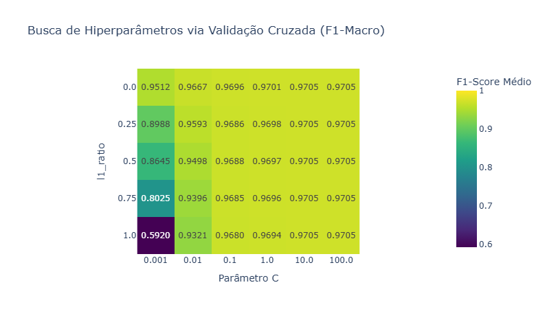
  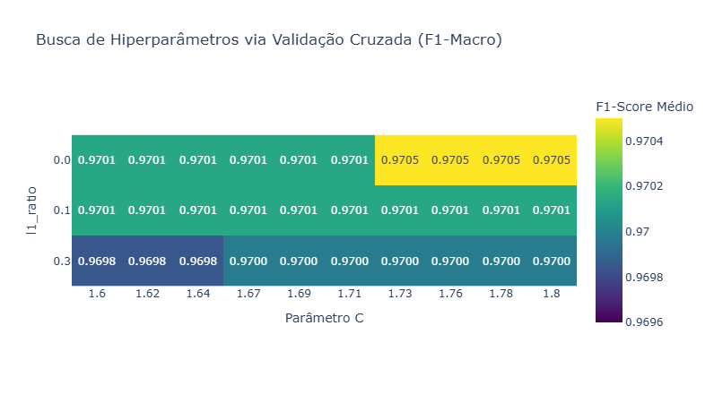
</div>

Nota-se que `l1_ratio = 0` equivale à regularização Ridge, que, provavelmente, supera o Lasso (l1_ratio = 1) neste cenário porque os dados de sensores possuem alta multicolinearidade (atributos fortemente correlacionados): enquanto o Lasso zera e descarta variáveis de forma arbitrária ao escolher apenas uma do grupo, o Ridge encolhe e distribui os pesos suavemente entre todas elas, preservando mais informação útil e garantindo maior estabilidade no modelo.


O modelo final foi testado para a classificação no conjunto de teste, tendo os seguintes resultados:

```
------------------------------
MÉTRICAS DE AVALIAÇÃO (Item A)
------------------------------
Acurácia Global        : 0.9437
Acurácia Balanceada    : 0.9424
Precisão (Macro)       : 0.9458
Sensibilidade (Macro)  : 0.9424
F1-Score (Macro)       : 0.9435
------------------------------
```

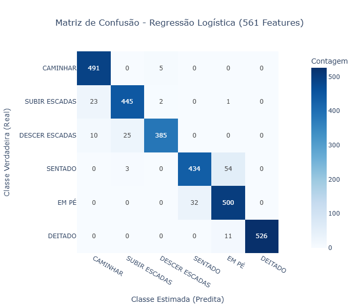

O modelo obteve um alto desempenho e elevado equilíbrio entre todas as atividades, evidenciado pelas métricas globais e macro próximas a **0,94** (com Acurácia Balanceada de **0,9424** e F1-Score Macro de **0,9435**). Apesar disso, a matriz de confusão evidencia dificuldades pontuais na distinção entre atividades com características físicas semelhantes.

Através da análise da matriz de confusão, destacam-se alguns pointos:

- O modelo praticamente não confunde atividades em movimento (*Caminhar*, *Subir Escadas*, *Descer Escadas*) com atividades estáticas (*Sentado*, *Em Pé*, *Deitado*). A distinção física clara nos dados de aceleração entre estar em movimento ou parado permitiu um isolamento quase perfeito entre esses dois grandes grupos.
-  O principal ponto de erro do modelo ocorre no grupo estático, especificamente entre *Sentado* e *Em Pé*. Registraram-se **54** amostras de *Sentado* classificadas incorretamente como *Em Pé* e **32** amostras de *Em Pé* classificadas como *Sentado*. Isto deve se justificar pelo fato de ambas as posições manterem o tronco do utilizador (e consequentemente os sensores) numa orientação vertical estática muito semelhante.
- No grupo dinâmico, a maior sobreposição ocorre entre *Subir Escadas* e *Caminhar* (23 amostras de *Subir* classificadas como *Caminhar*) e entre *Descer Escadas* e *Subir Escadas* (25 amostras de *Descer* classificadas como *Subir*). Como os ciclos de passada e os padrões de aceleração de subida, descida e caminhada no plano partilham frequências muito próximas, alguns padrões transitórios de impacto tornam-se difíceis de diferenciar apenas pela regressão logística.

---

## Item B

A avaliação da variação do parâmetro $k$ e das configurações de distância (Manhattan e Euclidiana) e ponderação (`uniform` e `distance`) via validação cruzada de 5 dobras revelou os seguintes padrões:

* **Efeito do valor de $k$:** O desempenho do classificador apresenta uma tendência estritamente decrescente à medida que o número de vizinhos $k$ aumenta. O valor máximo de F1-Macro na validação cruzada (**0,9839**) foi obtido com $k$ = 1.
* **Métrica de Distância:** A distância de Manhattan apresentou desempenho superior à distância Euclidiana em toda a faixa de $k$ analisada.
* **Ponderação por Distância vs. Uniforme:** Nota-se que, nos cenários onde $k$ > 1, a ponderação pelo inverso da distância (`distance`) demonstrou uma pequena superioridade sobre a ponderação uniforme (`uniform`). No entanto, para a configuração ótima de $k$ = 1, essa ponderação torna-se totalmente irrelevante, pois o único vizinho considerado recebe peso unitário em ambas as abordagens.


<div align="center">
  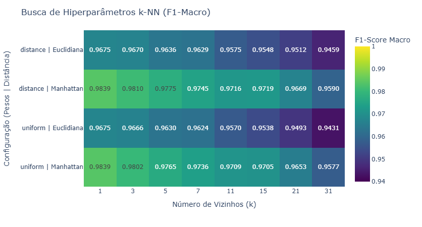
  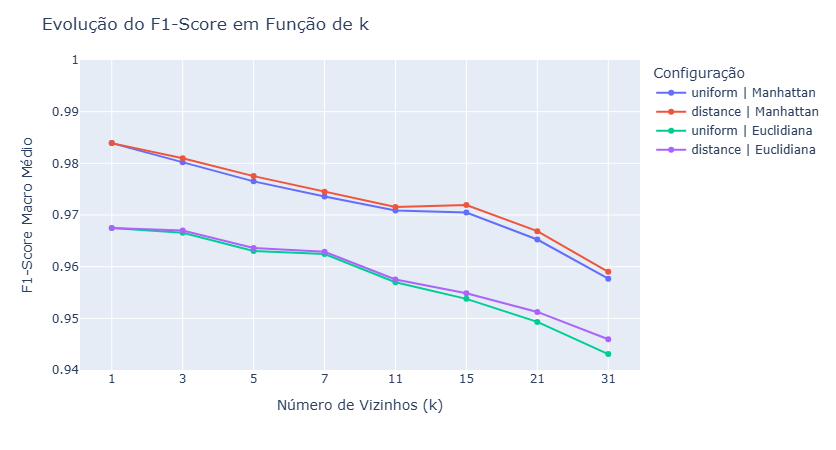
</div>

Assim, os melhores hiperparâmetros selecionados para o modelo final foram: **$k = 1$**, **distância de Manhattan ($p=1$)** e **pesos uniformes**.

Utilizando o modelo otimizado no conjunto de teste, obtiveram-se os seguintes resultados:

```
------------------------------
MÉTRICAS DE AVALIAÇÃO (Item B)
------------------------------
Acurácia Global        : 0.8738
Acurácia Balanceada    : 0.8683
Precisão (Macro)       : 0.8802
Sensibilidade (Macro)  : 0.8683
F1-Score (Macro)       : 0.8700
------------------------------
```
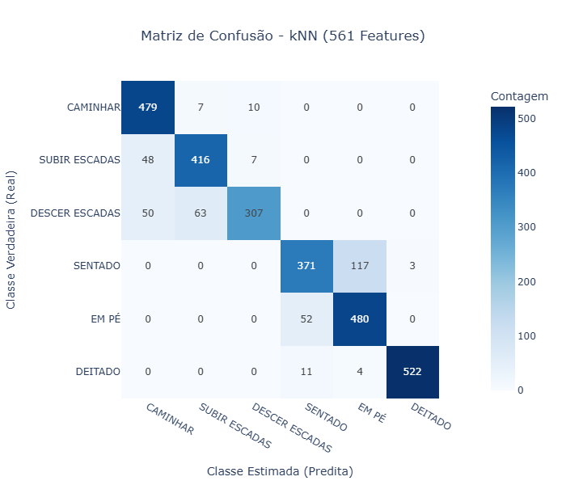


A análise da matriz de confusão do $k$-NN no conjunto de teste revela pontos críticos de erro:
- Confusão nas Atividades Estáticas: expressiva sobreposição entre *Sentado* e *Em Pé*, com 117 amostras de Sentado classificadas incorretamente como *Em Pé*.
- Confusão nas Atividades Dinâmicas: A classe *Descer Escadas* sofreu forte degradação de sensibilidade: das 420 amostras reais, 50 foram preditas como Caminhar e 63 como Subir Escadas (totalizando 113 erros direcionados a outras atividades de movimento).

Comparando os dois classificadores destacam-se diferenças de generalização e sensibilidade à dimensão dos dados:
- **Degradação e Overfitting:** O $k$-NN apresentou uma queda acentuada de desempenho do conjunto de validação cruzada (F1-Macro de 0,9839) para o conjunto de teste (F1-Macro de 0,8700). Por utilizar $k=1$, o modelo é extremamente suscetível a overfitting e ruídos locais nos dados de treino.
- **Maldição da Dimensionalidade:** Como o espaço original possui 561 atributos, a métrica de distância no $k$-NN perde poder discriminativo no espaço de alta dimensão, tornando vizinhos mais próximos geométricos nem sempre semanticamente equivalentes.
- **Superioridade da Regressão Logística:** A Regressão Logística superou expressivamente o $k$-NN no conjunto de teste (**0,9435** contra **0,8700** no F1-Macro). Como modelo paramétrico regularizado, a regressão logística estabelece hiperplanos de decisão globais que lidam substancialmente melhor com a multicolinearidade e reduzem o impacto do ruído individual dos sensores, garantindo maior estabilidade e capacidade de generalização.

---

## Item C


| Modelo | Melhores Hiperparâmetros | Acurácia Global | F1-Score |
| :--- | :--- | :--- | :--- |
| **Regressão Logística** | $C$ = 1.04 ; `l1_ratio` = 0.5 | 0,5640 | 0,5342 |
| **k-Nearest Neighbors (k-NN)** | $k$ = 1 ; Manhattan | 0,7418 | 0,7407 |


### Sobre Regressão Logística

<div align="center">
  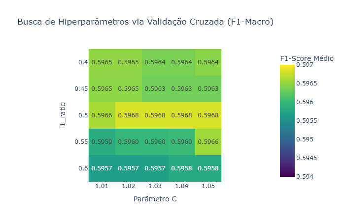
  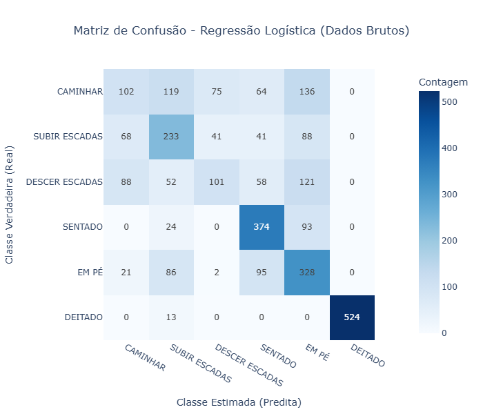
</div>

- **Desempenho Limitado em Dados Brutos**: A Regressão Logística apresentou um F1-Score Macro estagnado na faixa dos 53%. Imagina-se que, por ser um classificador de fronteiras lineares, o modelo é incapaz de mapear adequadamente as separações complexas exigidas por dados inerciais brutos (*raw inertial signals*), que possuem fronteiras de decisão altamente não-lineares.
- **Sensibilidade à Regularização**: A otimização via Grid Search indicou uma preferência pela combinação de penalidades L1 e L2 (ElasticNet, com `l1_ratio` = 0.5 e `C` = 1.04). Essa configuração é a tentativa do modelo linear de lidar com a altíssima dimensionalidade e multicolinearidade das janelas temporais, encolhendo pesos redundantes e zerando os ruídos.


### Sobre o k-Nearest Neighbors (k-NN)

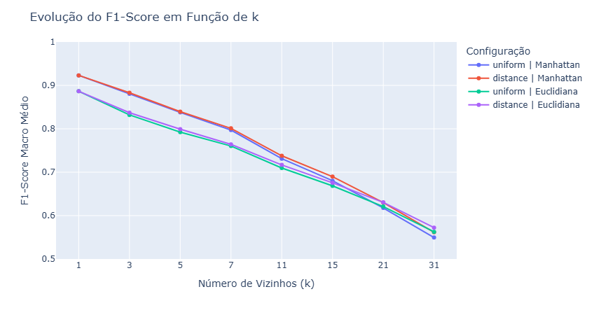

<div align="center">
  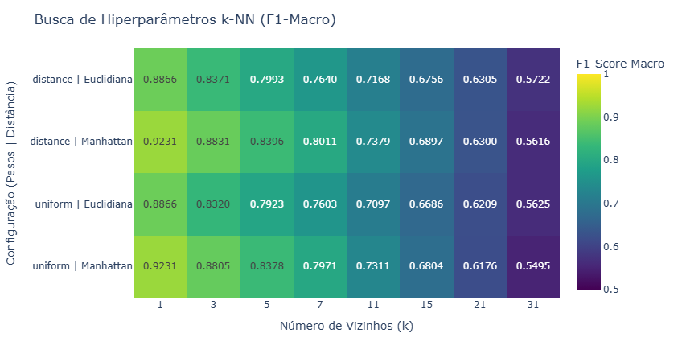
  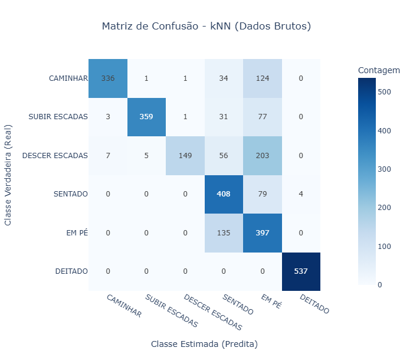
</div>

- O melhor F1-Score na validação cruzada foi obtido com $k$ = 1 vizinho. Conforme o número de vizinhos $k$ aumenta, o desempenho cai progressivamente. Isso indica que o espaço de atributos brutos preserva uma vizinhança local extremamente específica para cada janela temporal, e aumentar $k$ introduz um efeito de suavização que mistura padrões de movimentos distintos.
- A distância de Manhattan superou a distância Euclidiana novamente. Em espaços de alta dimensão, a métrica $L_1$ tende a ser menos sensível a outliers e variações pontuais de amplitude nas séries temporais do que a métrica $L_2$.
- **Falha Crítica (Descer Escadas vs. Em Pé)**: A matriz revela um erro estrutural severo. O k-NN classificou instâncias reais de *Descer Escadas* como *Em Pé* **203 vezes**, número superior às próprias predições corretas da classe (149 acertos). Esse comportamento pode estar relacionado à semelhança entre determinados segmentos dos sinais de aceleração durante a descida de escadas e os padrões observados em atividades estáticas, sem o domínio da frequência para discernir a energia do movimento da constante gravitacional. Entretanto, a matriz de confusão, isoladamente, não permite confirmar essa hipótese, sendo necessária uma análise mais aprofundada dos sinais temporais para identificar a origem dos erros.
- **Ilusão da Acurácia Global**: Uma Acurácia Global de 74,18% no k-NN pode transmitir uma falsa sensação de estabilidade. Quando há erros altamente concentrados, a acurácia global "mascara" essas falhas diluindo-as nas classes de fácil predição (como Deitado e Sentado).

---

## Conclusões

A análise dos resultados evidencia a importância tanto da escolha do classificador quanto da representação dos dados para o desempenho em tarefas de reconhecimento de atividades humanas (HAR).

Nos experimentos realizados com os atributos extraídos do UCI HAR, a Regressão Logística apresentou o melhor desempenho, alcançando F1-Score Macro de 94,35% no conjunto de teste. O resultado indica que, apesar de sua natureza linear, o modelo foi capaz de aproveitar adequadamente as características previamente extraídas dos sinais inerciais, beneficiando-se também da regularização para lidar com a dimensionalidade e as correlações entre os atributos.

Por outro lado, o k-NN apresentou desempenho inferior nesse cenário, com F1-Score Macro de 87,00%. Embora tenha alcançado resultados bastante elevados durante a validação cruzada, sua queda no conjunto de teste evidencia limitações de generalização na configuração avaliada. A utilização de apenas um vizinho como melhor hiperparâmetro também indica uma forte dependência de similaridades locais entre as amostras, tornando o modelo mais suscetível a variações presentes nos dados.

A aplicação dos mesmos classificadores diretamente sobre os sinais brutos resultou em uma redução de desempenho para ambos os modelos. A Regressão Logística apresentou F1-Score Macro de 53,42%, enquanto o k-NN alcançou 74,07%. Essa diferença sugere que a representação dos dados exerce influência significativa sobre a capacidade de aprendizado dos classificadores. Enquanto os atributos extraídos condensam informações relevantes sobre as características dos movimentos, os sinais brutos exigem que o próprio modelo identifique padrões temporais e relações mais complexas a partir das leituras dos sensores.

As matrizes de confusão também permitiram identificar limitações específicas que não seriam evidenciadas apenas pelas métricas globais. Destaca-se a dificuldade de diferenciar atividades fisicamente semelhantes, como Sentado e Em Pé, além dos erros envolvendo Subir Escadas, Descer Escadas e Caminhar. Nos dados brutos, a confusão expressiva entre Descer Escadas e Em Pé evidencia uma dificuldade adicional na identificação de determinados padrões de movimento a partir da representação utilizada.

Por fim, os experimentos reforçam a importância da engenharia de atributos e do tratamento adequado dos sinais para o reconhecimento de atividades humanas. Técnicas como a extração de características no domínio da frequência, o cálculo de grandezas derivadas do movimento e a separação das componentes gravitacional e dinâmica da aceleração representam possibilidades de investigação para melhorar a discriminação entre atividades. Além disso, a utilização de estratégias de validação agrupadas por voluntário, como GroupKFold, permitiria avaliar de maneira mais rigorosa a capacidade de generalização dos modelos para indivíduos não observados durante o treinamento.

Dessa forma, os resultados obtidos demonstram que o desempenho de um classificador não depende exclusivamente de sua complexidade ou capacidade de representar fronteiras não lineares, mas também da qualidade das informações fornecidas ao processo de aprendizado e da metodologia utilizada para avaliar sua generalização.


## Referências

1. TochaFh/IA048-ML-Atividades (repositório com as atividades na disciplina IA048 em 2s2026) https://github.com/TochaFh/IA048-ML-Atividades
2. Scikit-learn: Machine Learning in Python, Pedregosa et al., JMLR 12, pp. 2825-2830, 2011. https://scikit-learn.org/stable/
3. Plotly-express. https://plotly.com/python/plotly-express/
4. Cookiecutter Data Science. https://cookiecutter-data-science.drivendata.org/
5. Reyes-Ortiz, J., Anguita, D., Ghio, A., Oneto, L., & Parra, X. (2013). Human Activity Recognition Using Smartphones [Dataset]. UCI Machine Learning Repository. https://doi.org/10.24432/C54S4K.